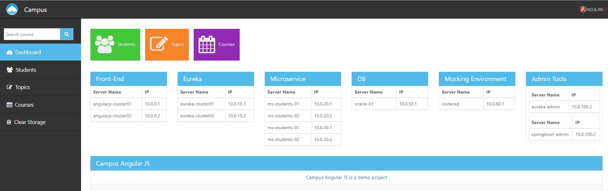

# Campus Angular10

Original Project built with AngularJS. <br/>
This project is the migration to Angular10. (STILL in progress)<br/>
Please download and run the original project to see the working version of the app: [campus-angularjs](https://github.com/ermalaliraj/campus-angularjs)



## Run

Download the project locally:

```
git clone https://github.com/ermalaliraj/campus-angular10.git
cd campus-angular10
npm install --save-dev @angular-devkit/build-angular  (or only npm install)
ng serve
```
The application will be served on:
```
http://localhost:4200/
```

## Technologies 
- Angular10


## Steps used to create the project
```
ng new campus-angular10
--no routing, scss 
npm install bootstrap --save
npm install angular2-toaster
npm install --save font-awesome

npm install @fortawesome/fontawesome-svg-core
npm install @fortawesome/angular-fontawesome@0.7.x
```

## See
* [Campus-MS](https://github.com/ermalaliraj/campus-ms) Microservice layer
* [campus-angularjs](https://github.com/ermalaliraj/campus-angularjs) AngularJS version


npm install ngx-pagination --save


